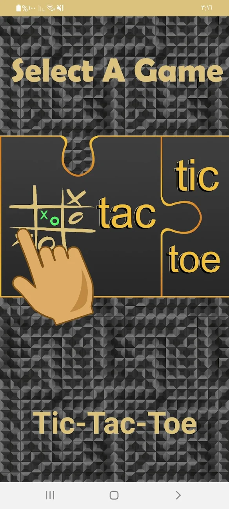
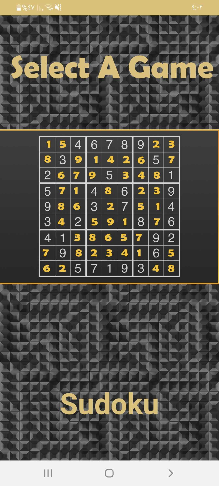
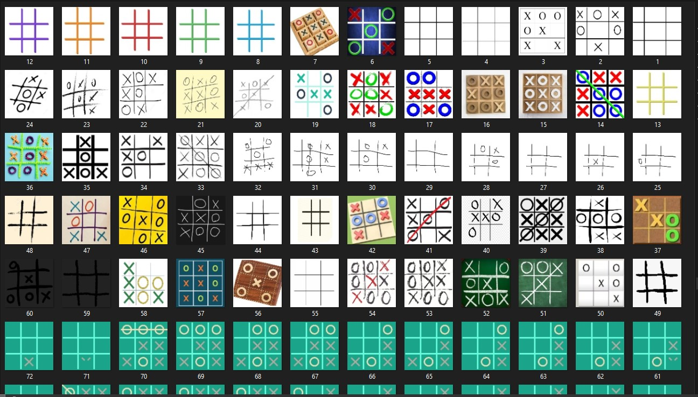
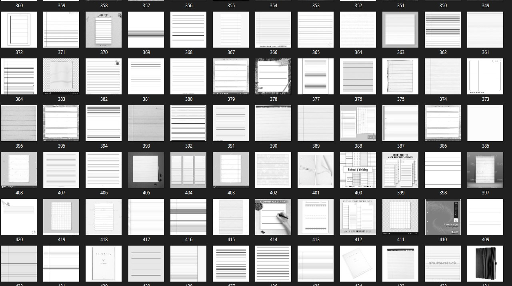
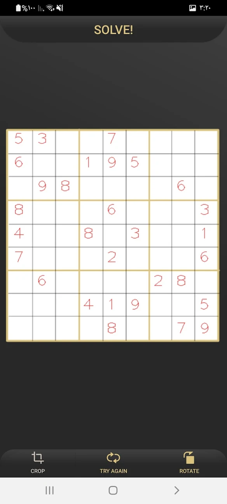
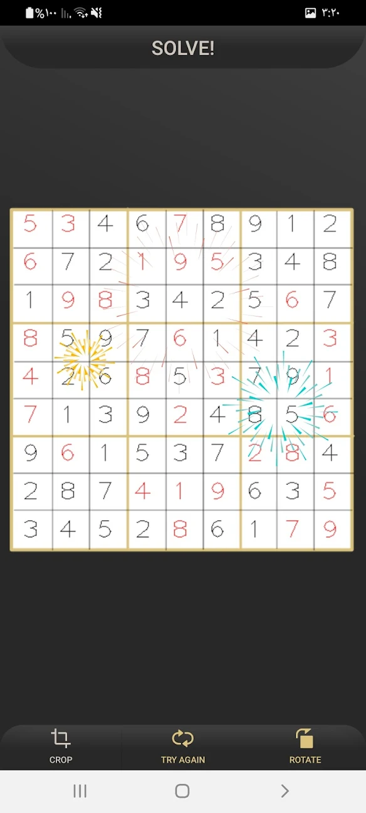
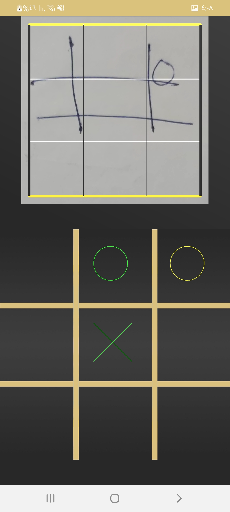
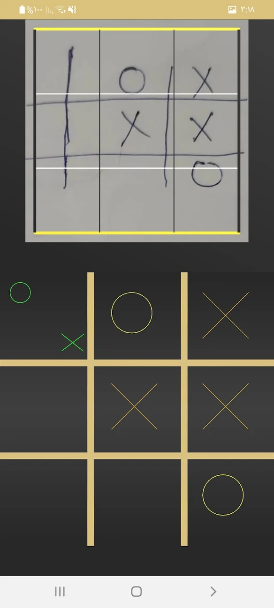

<!-- PROJECT LOGO -->
 

  
  
   
    <a href="https://play.google.com/store/apps/details?id=com.hostile.cheatic">View app</a>

 
 <!-- TABLE OF CONTENTS -->

  
Table of Contents

  <ol>
    <li>
      <a href="#about">About The Project</a>
      <ul>
        <li><a href="#built_with">Built With</a></li>
      </ul>
    </li>
    <li><a href="#overall_Outcomes">Overall Outcomes/Achievements</a></li>
    <li>
      <a href="#how_it_works">How it works</a>
      <ul>
        <li><a href="#create_classification_model">Using Python to create classification model</a></li>
        <li><a href="#detection_process">Object detection process</a></li>
        <li><a href="#sudoku_code">Sudoku algorithm</a></li>
        <li><a href="#tic_tac_toe_code">Tic-Tac-Toe algorithm</a></li>
        <li><a href="#images">Images</a></li>
      </ul>
    </li>
  </ol>

<!-- ABOUT THE PROJECT -->
<a name="about"/>

## About The Project
  
A puzzle solver app which uses computer vision technology to distingue puzzle games and uses AI that is built using minimax and backtracking algorithms to solve them.
  

    
    
  

  
<a name="built_with"/>  

### Built With

* [Kotlin](https://kotlinlang.org)
* [OpenCV](https://opencv.org)
* [TensorFlow-tools](https://www.tensorflow.org)
* [ML Kit-tools](https://developers.google.com/ml-kit)
* [Python](https://www.python.org)

<a name="overall_Outcomes"/>  

<!-- Outcomes -->

## Overall Outcomes/Achievements
  
  1. Solving Sudoku game by using backtracking algorithm.    
  
  2. Solving Tic-Tac-Toe game by using minimax algorithm.
  
  3. Provide User friendly interface design.

<a name="how_it_works"/>  

## How it works
  

  <a name="create_classification_model"/>
  
Using Python to create classification model:

  <ol>
    <li>
      
Before the training, we start by collect hundreds of images that are divided into two sections, Positive and negative images.

      <ul>
        <li>positive images are images that contain the object of interest.</li>
        <li>negative images are images that do not contain the object of interest (better to include images that are somehow related to the object environment but not the object itself).</li>
      </ul>
    </li>
    <li>
      
After gathering a good amount of images, we clean up the data.

      <ul>
        <li>Cropping each image if needed.</li>
        <li>Resizing each image into (210 X 210) which is a perfect size to detect an object from the camera.</li>
        <li>Converting each image into grayscale.</li>
        <li>Renaming each image in an ascending order.</li>
      </ul>
    </li>
     
    

    

      
      
Collection of Positive images

    

    

      
      
Collection of Negative images

    

    

    <li>
<a target="_blank" href="https://teachablemachine.withgoogle.com"> Using machine leaning tools to train the data and generate tflite file.</a>
</li>
    <li>
Classification model embedded into the app to recognize objects.
</li>
  </ol>
  
  <a name="detection_process"/>  
  
  
Object detection process:

  
  1. Capture data from the camera.
  
  2. Clean up the captured image.
  
  3. Apply warp perspective
  
  4. Detect object.
  
  5. Use smart algorithm to solve it.
  
  <a name="sudoku_code"/>  
   
  
Sudoku algorithm:

  
      fun solve_sudoku(): Boolean { //using Backtracking algorithm
        var empty = get_empty() //get next empty box
        if (empty.isEmpty()) //if there is nothing inside empty then the board is solved
            return true
            
        //take location of empty box
        var row = empty[0] 
        var col = empty[1]

        for (i in 1..9){
            var istr = i.toString()
            if (isValid(row,col,istr)){ //check if (i) inside the box is valid or not
                board[row][col]=istr 
                if (solve_sudoku()) //if valid go deeper until it returns true
                    return true
            }
            board[row][col]=""
        }
        return false // Board can not be solved!
    }
  
  <a name="tic_tac_toe_code"/> 
  
  
Tic-Tac-Toe algorithm:

       
      private fun miniMax(board: Array<Array<Int>>, isMax: Boolean): Int { // solve using minimax algorithm
        var winnerPlayer = winner(board) //take current board and get winner if exist
        if (winnerPlayer != -1) //if there is a winner or draw return point
            return when (winnerPlayer) {
                ai -> 10
                enemy -> -10
                else -> 0
            }
        // if maximizing player
        if (isMax) {
            var bestScore = -999 //predict the worse for the player
            for (i in 0..2) {
                for (j in 0..2) {
                    if (board[i][j] == 0) {
                        board[i][j] = ai //temp move
                        var currScore = miniMax(board, false) //go deeper
                        board[i][j] = 0 //undo the change
                        bestScore = max(currScore, bestScore)
                    }
                }
            }
            return bestScore
        } else { // if minimizing player (enemy)
            var bestScore = 999 //predict the best for the enemy
            for (i in 0..2) {
                for (j in 0..2) {
                    if (board[i][j] == 0) {
                        board[i][j] = enemy //temp move
                        var currScore = miniMax(board,true) //go deeper
                        board[i][j] = 0 //undo the change
                        bestScore = min(currScore, bestScore)
                    }
                }
            }
            return bestScore
        }
    }
     
   
   
  
  <a name="images"/>  
  
  
  
  
   
   
  
  

